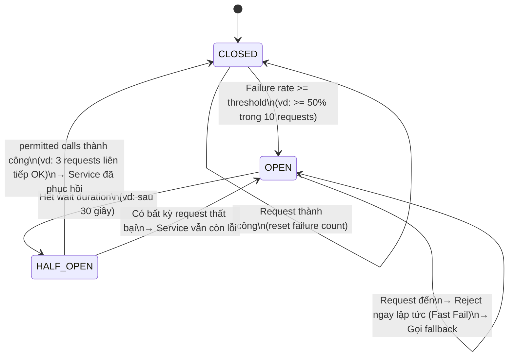

# Circuit Breaker — Báo cáo thực hành

---

## (1) State Diagram



### Giải thích các trạng thái

| State | Hành vi | Chuyển sang |
|---|---|---|
| **CLOSED** | Bình thường, cho tất cả request đi qua. Đếm failure. | → OPEN khi failure rate >= threshold |
| **OPEN** | Từ chối toàn bộ request, không gọi service. Trả fallback ngay. | → HALF-OPEN sau khi hết wait duration |
| **HALF-OPEN** | Cho một số lượng nhỏ request thử nghiệm đi qua. | → CLOSED nếu thành công; → OPEN nếu vẫn lỗi |

---

## (2) Code mô phỏng — Dùng thư viện Resilience4j

> Thư viện: **Resilience4j** (modern alternative của Netflix Hystrix, native support Spring Boot 3)

### Kiến trúc tổng quan

```
POST /api/orders
       ↓
 CreateOrderService
       ↓
 PaymentServicePort (interface)
       ↓
 PaymentServiceClient (@Component)
       ↓  @Retry(name="paymentService")       → thử lại tối đa 3 lần
       ↓  @CircuitBreaker(name="paymentService") → mở CB khi failure rate >= 50%
       ↓
 Simulator (PaymentMode: SUCCESS / TIMEOUT / ALWAYS_FAIL)
       ↓ (khi OPEN)
 chargeWithFallback() → trả PaymentResponse với success=false + message thông báo
```

### Các tình huống mô phỏng

| Mode | Hành vi | Tác động |
|---|---|---|
| `SUCCESS` | Trả kết quả ngay | CB đếm success, duy trì CLOSED |
| `TIMEOUT` | Sleep 5s → ném `PaymentTransientException` | Retry 3 lần, mỗi lần cách 1s; CB đếm failure |
| `ALWAYS_FAIL` | Ném `PaymentTransientException` ngay | Sau ≥5 calls với failure rate ≥50% → CB mở (OPEN) |

### Demo flow

```bash
# Bước 1: Payment hoạt động bình thường (CB: CLOSED)
PUT /api/simulator/payment-mode/SUCCESS
POST /api/orders  → 200 OK, payment success

# Bước 2: Payment trả lỗi liên tục → CB mở
PUT /api/simulator/payment-mode/ALWAYS_FAIL
POST /api/orders  → Retry 3x → CB failure count tăng
POST /api/orders  → Retry 3x → CB failure count tăng
POST /api/orders  → CB kiểm tra: failure rate >= 50% → CB OPEN!

# Bước 3: CB đang OPEN → Fast Fail + Fallback
POST /api/orders  → Immediate fallback (không gọi payment)
POST /api/orders  → Immediate fallback
# → Log: "[CIRCUIT BREAKER] OPEN — Payment service unavailable"

# Bước 4: Sau 30 giây → CB tự chuyển HALF-OPEN
# Bước 5: Đổi lại SUCCESS để service "phục hồi"
PUT /api/simulator/payment-mode/SUCCESS
POST /api/orders  → CB test request → Success → CB CLOSED!
```

### Code chính: PaymentServiceClient

```java
@Slf4j
@Component
public class PaymentServiceClient implements PaymentServicePort {

    @Override
    @Retry(name = "paymentService")                    // Retry tối đa 3 lần
    @CircuitBreaker(name = "paymentService",
                    fallbackMethod = "chargeWithFallback")  // Fallback khi OPEN
    public PaymentResponse charge(String orderId, double amount) {
        return switch (currentMode.get()) {
            case SUCCESS    -> handleSuccess(orderId, amount);
            case TIMEOUT    -> handleTimeout(orderId);   // sleep 5s → throw
            case ALWAYS_FAIL -> handleAlwaysFail(orderId); // throw immediately
        };
    }

    // Fallback — gọi khi Circuit Breaker đang OPEN
    public PaymentResponse chargeWithFallback(String orderId, double amount, Throwable ex) {
        log.warn("[CIRCUIT BREAKER] OPEN — orderId={}, reason={}", orderId, ex.getMessage());
        return PaymentResponse.fallback(
            "Payment service tạm thời không khả dụng. " +
            "Đơn hàng [" + orderId + "] sẽ được xử lý khi service phục hồi."
        );
    }
}
```

---

## (2) Cấu hình

### `application.yml`

```yaml
resilience4j:
  circuitbreaker:
    instances:
      paymentService:
        # Failure threshold: mở CB khi >= 50% request fail
        failure-rate-threshold: 50

        # Số request tối thiểu trước khi CB bắt đầu tính failure rate
        minimum-number-of-calls: 5

        # Timeout: thời gian chờ ở OPEN trước khi thử lại (HALF-OPEN)
        wait-duration-in-open-state: 30s

        # Số request được phép thử trong HALF-OPEN
        permitted-number-of-calls-in-half-open-state: 3

        # Sliding window: đếm trên 10 request gần nhất
        sliding-window-type: COUNT_BASED
        sliding-window-size: 10

        # Tự động chuyển HALF-OPEN sau khi hết timeout
        automatic-transition-from-open-to-half-open-enabled: true

  retry:
    instances:
      paymentService:
        # Retry count: thử lại tối đa 3 lần (tổng gồm lần đầu)
        max-attempts: 3

        # Thời gian chờ giữa các lần retry
        wait-duration: 1s

        # Chỉ retry với lỗi transient (không retry lỗi business logic)
        retry-exceptions:
          - java.util.concurrent.TimeoutException
          - java.net.ConnectException
          - com.example.orderservice.adapter.out.payment.PaymentTransientException
```

### Giải thích từng tham số

| Tham số | Giá trị | Ý nghĩa |
|---|---|---|
| `failure-rate-threshold` | `50` (%) | CB mở khi ≥50% trong sliding window là failure |
| `minimum-number-of-calls` | `5` | Cần ít nhất 5 calls trước khi CB quyết định mở |
| `wait-duration-in-open-state` | `30s` | CB ở OPEN 30 giây rồi mới thử HALF-OPEN |
| `permitted-number-of-calls-in-half-open-state` | `3` | Cho phép 3 test requests khi HALF-OPEN |
| `sliding-window-size` | `10` | Tính failure rate trên 10 request gần nhất |
| `max-attempts` (retry) | `3` | Thử lại tối đa 3 lần (retry 2 lần sau lần đầu) |
| `wait-duration` (retry) | `1s` | Chờ 1 giây giữa mỗi lần retry |

### Fallback Behavior

Khi Circuit Breaker đang **OPEN**, thay vì báo lỗi 500, hệ thống trả về:

```json
{
  "paymentId": "FALLBACK-1234567890",
  "success": false,
  "message": "Payment service tạm thời không khả dụng. Đơn hàng [order-001] sẽ được xử lý khi service phục hồi."
}
```

→ Order vẫn được lưu với trạng thái **PENDING** — đây là **Graceful Degradation**: hệ thống vẫn hoạt động được ở mức giảm chức năng thay vì sập hoàn toàn.


---

## (4) Phân tích sự khác nhau giữa Retry và Circuit Breaker

### Bảng so sánh

| Tiêu chí | **Retry** | **Circuit Breaker** |
|---|---|---|
| **Mục đích** | Thử lại request khi gặp lỗi tạm thời | Ngừng gọi service đang bị lỗi để bảo vệ hệ thống |
| **Phạm vi** | Cấp độ từng request riêng lẻ | Cấp độ toàn bộ luồng gọi tới 1 service |
| **Khi nào dùng** | Lỗi transient (mạng chập chờn, timeout ngắn) | Service down kéo dài / liên tục trả lỗi |
| **Hành động** | Gọi lại service N lần | Ngắt kết nối hoàn toàn, dùng fallback |
| **Tác động tài nguyên** | **Tốn tài nguyên hơn** (gọi nhiều lần) | **Tiết kiệm tài nguyên** (fast-fail) |
| **Nguy cơ** | Retry storm — nếu quá nhiều client retry cùng lúc có thể làm service sập hoàn toàn | Cần cấu hình thresholds cẩn thận để tránh mở CB sai |
| **Thời gian phản hồi** | Chậm hơn (phải chờ mỗi lần retry) | Nhanh (từ chối ngay lập tức khi OPEN) |
| **Tự hồi phục** | Không — chỉ thử lại N lần rồi thôi | Có — tự chuyển HALF-OPEN → CLOSED khi service phục hồi |
| **Fallback** | Không có built-in | Có — khi OPEN sẽ gọi fallback method |

### Khi nào dùng cái nào?

**Dùng Retry khi:**
- Lỗi mang tính tạm thời (network blip, timeout nhỏ)
- Service có thể phục hồi trong vài giây
- Số lần retry nhỏ (2-3 lần) với backoff

**Dùng Circuit Breaker khi:**
- Service down kéo dài
- Cần tránh cascading failure trong microservices
- Muốn fast-fail thay vì chờ timeout

**Best practice: Kết hợp cả hai**
```
Request → [Retry 3 lần] → [Circuit Breaker] → Payment Service
                                  ↓ (khi OPEN)
                              Fallback Response
```
- Retry xử lý lỗi tạm thời → giảm tải CB
- Circuit Breaker bảo vệ hệ thống khi service sập hẳn

### Ví dụ thực tế minh họa

```
Scenario: Payment Service bị lỗi liên tục

Chỉ dùng Retry:
  Request #1 → Retry 3x → Timeout 3s mỗi lần → Tổng 9s chờ
  Request #2 → Retry 3x → Timeout 9s
  Request #3 → Retry 3x → Timeout 9s
  → Thread pool exhausted → Cascading failure! 💥

Dùng Circuit Breaker:
  Request #1 → Fail → CB đếm failure
  Request #2 → Fail → CB đếm failure
  ...
  Request #5 → failure rate >= 50% → CB mở (OPEN)
  Request #6,7,8... → Fast-fail ngay (0ms) → Fallback response
  → Thread pool an toàn, hệ thống ổn định ✅
  
  Sau 30s: CB → HALF-OPEN → thử 1 request
  Nếu thành công: CB → CLOSED, bình thường trở lại
```
