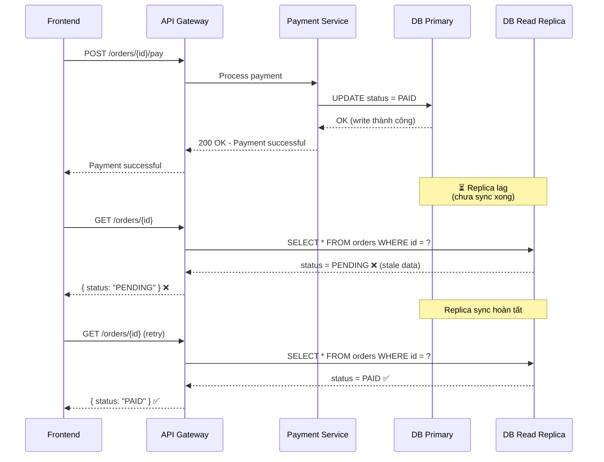
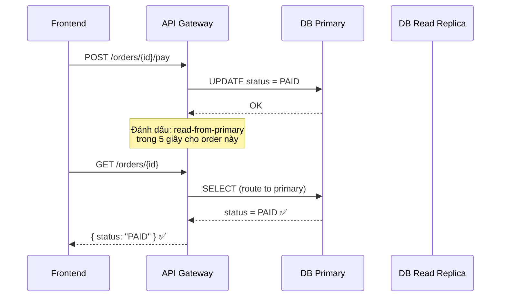

# Consistency Models

## 1. Bảng so sánh các Consistency Models

| **Model** | **Định nghĩa** | **Ví dụ** | **Ưu điểm** | **Rủi ro/giới hạn** |
| --- | --- | --- | --- | --- |
| **Strong Consistency** | Sau khi write thành công, mọi read tiếp theo (từ bất kỳ node nào) đều phải trả về giá trị mới nhất. Mọi client đều nhìn thấy cùng một trạng thái tại cùng thời điểm. | Hệ thống ngân hàng: sau khi chuyển tiền thành công, mọi truy vấn số dư (dù từ ATM, app, hay web) đều phải thấy số dư đã cập nhật. | Dữ liệu luôn chính xác, không có stale read. Dễ reasoning cho developer — logic giống single-node database. | Latency cao vì phải đợi tất cả replicas xác nhận (synchronous replication). Throughput thấp. Giảm availability khi network partition xảy ra (theo CAP theorem, phải hy sinh A hoặc P). |
| **Eventual Consistency** | Các replicas có thể trả về dữ liệu khác nhau trong một khoảng thời gian (inconsistency window), nhưng cuối cùng sẽ hội tụ (converge) về cùng một giá trị khi không còn write mới. | Social media feed: sau khi đăng một bài post, bạn bè ở region khác có thể mất vài giây mới thấy bài post đó. Không ảnh hưởng nghiêm trọng vì tính chất dữ liệu không critical. | Latency thấp, throughput cao. Availability cao — hệ thống vẫn hoạt động khi một số replicas down. Scale horizontally dễ dàng. | Có thể đọc dữ liệu cũ (stale read). Khó reasoning — developer phải xử lý conflict và inconsistency. Không phù hợp cho dữ liệu critical (tài chính, inventory). |
| **Read-your-writes** | User vừa write dữ liệu thì chính user đó đọc lại phải thấy dữ liệu mình vừa ghi. Các user khác có thể tạm thời chưa thấy. | User đổi avatar trên profile. Khi user đó refresh trang, phải thấy avatar mới. Tuy nhiên, bạn bè có thể tạm thấy avatar cũ. | User experience tốt — không bị "mất" dữ liệu mình vừa thay đổi. Cân bằng giữa consistency và performance. | Cần mechanism để route read về đúng node (sticky session, read-from-primary after write). Phức tạp hơn eventual consistency thuần. |
| **Monotonic Reads** | Nếu một user đã đọc thấy giá trị X tại thời điểm T, thì các lần read sau đó không được trả về giá trị cũ hơn X. Dữ liệu chỉ "tiến về phía trước", không bao giờ "lùi lại". | User xem order status là CONFIRMED, nhưng lần refresh sau lại thấy PENDING (do bị route sang replica chậm hơn). Monotonic reads đảm bảo điều này không xảy ra. | Tránh trải nghiệm confusing cho user khi dữ liệu "nhảy" qua lại. Dễ implement hơn strong consistency. | Cần track version/timestamp của lần read cuối để đảm bảo read tiếp theo từ replica đủ mới. Có thể tăng latency nếu replica gần nhất chưa đủ mới. |
| **Causal Consistency** | Nếu event B có quan hệ nhân quả (causally dependent) với event A (B xảy ra sau A và phụ thuộc vào A), thì mọi node phải thấy A trước khi thấy B. Các event không liên quan nhau có thể thấy theo thứ tự khác nhau. | User tạo post (event A), sau đó comment vào post đó (event B). Mọi replica phải hiển thị post trước rồi mới hiển thị comment. Không được thấy comment mà chưa thấy post. | Bảo toàn logic nhân quả — user không thấy dữ liệu vô nghĩa. Mạnh hơn eventual consistency nhưng nhẹ hơn strong consistency. | Cần vector clock hoặc dependency tracking để xác định quan hệ nhân quả. Phức tạp trong implementation. Không đảm bảo total order cho các event không liên quan. |

---

## 2. Tình huống Stale Read

### Mô tả vấn đề

```
Order vừa được payment thành công.
Frontend gọi GET /orders/{id} nhưng request bị route sang read replica chưa sync.
Frontend thấy PENDING thay vì PAID.
```

### Sequence Diagram



---

## 3. Đề xuất giải pháp và Trade-off

### Giải pháp 1: Read from Primary sau write (trong khoảng thời gian ngắn)

**Cách hoạt động:** Sau khi thực hiện write, trong một khoảng thời gian nhất định (ví dụ 5 giây), các request read tiếp theo sẽ được route đến **primary** thay vì replica.



| **Trade-off** | **Chi tiết** |
| --- | --- |
| ✅ Ưu điểm | Đảm bảo read-your-writes consistency. Đơn giản, dễ implement. |
| ⚠️ Nhược điểm | Tăng tải lên primary. Nếu nhiều user write cùng lúc → primary bị quá tải. Cần cơ chế tracking thời gian write gần nhất (cache/cookie). |

---

### Giải pháp 2: Return dữ liệu mới ngay trong response của command

**Cách hoạt động:** Response của API `POST /orders/{id}/pay` trả về luôn trạng thái mới nhất. Frontend sử dụng dữ liệu từ response này để cập nhật UI, **không cần gọi GET ngay lập tức**.

```
POST /orders/{id}/pay
→ Response: {
    "orderId": "123",
    "status": "PAID",        ← trả về luôn
    "paidAt": "2024-01-15T10:30:00Z"
  }
```

Frontend cập nhật local state bằng dữ liệu từ response, tránh hoàn toàn vấn đề stale read.

| **Trade-off** | **Chi tiết** |
| --- | --- |
| ✅ Ưu điểm | Không có stale read vì không cần query lại. Không tăng tải primary. Zero latency cho việc hiển thị trạng thái mới. |
| ⚠️ Nhược điểm | Chỉ giải quyết cho chính request đó. Nếu user mở tab mới hoặc refresh → vẫn có thể stale read. Cần kết hợp với giải pháp khác cho trường hợp refresh. |


