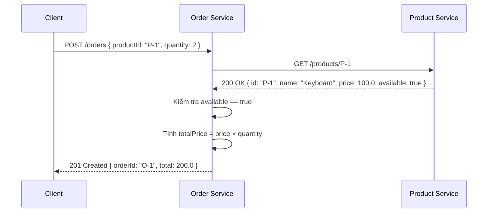

# 4. The Need for Contract Testing in Microservices

## 1. Phân tích dependency của Order Service

| **Dependency** | **Consumer expectation** | **Nếu provider đổi sai** | **Unit test có phát hiện không?** | **E2E test có hạn chế gì?** |
|---|---|---|---|---|
| Product Service | `GET /products/{id}` trả về `{ id, name, price, available }` với đúng tên field và kiểu dữ liệu | Provider đổi `name` → `productName`, xóa field `available` → Order Service parse lỗi, logic kiểm tra tồn kho sai | Không. Unit test dùng mock cũ nên vẫn pass dù provider đã thay đổi response thật | Chạy chậm, cần deploy toàn bộ hệ thống; flaky do phụ thuộc network/DB; khó cover hết mọi combination response |
| Payment Service | `POST /payments` nhận `{ orderId, amount, currency }` và trả `{ paymentId, status }` | Provider đổi field `status` từ string (`"SUCCESS"`) sang enum number (`1`), hoặc thêm field bắt buộc `paymentMethod` → Order Service gửi request bị reject hoặc parse response sai | Không. Mock giả lập response cũ, không phản ánh schema mới của provider | Cần Payment Service thật (hoặc sandbox) chạy ổn định; test chậm, khó chạy trong CI thường xuyên; khó tái tạo các error case |

## 2. Vì sao mock-based unit test không đủ?

- Mock do **consumer tự tạo** dựa trên giả định về provider → khi provider thay đổi API, mock **không tự cập nhật**.
- Unit test vẫn pass với mock cũ nhưng **production fail** vì response thật đã khác.
- Mock không kiểm tra được provider có thực sự trả đúng format hay không → tạo ra **false confidence**.

## 3. Vì sao chỉ dùng end-to-end test không đủ?

- **Chậm**: cần deploy tất cả service, database, infrastructure → feedback loop dài.
- **Flaky**: phụ thuộc network, data seeding, service availability → test hay fail vì lý do ngoài code.
- **Khó scale**: N service × M endpoint × K scenario = quá nhiều combination cần cover.
- **Phát hiện muộn**: chỉ chạy được ở stage cuối pipeline, lỗi tìm ra khi đã merge code.

## 4. Contract test đứng ở đâu trong testing pyramid?

```
        /\
       /  \        ← E2E test (ít, chậm, costly)
      /----\
     /      \      ← Contract test ← NẰM Ở ĐÂY
    /--------\
   /          \    ← Integration test
  /------------\
 /              \  ← Unit test (nhiều, nhanh, rẻ)
/________________\
```

Contract test nằm **giữa unit test và E2E test**:
- **Nhanh hơn E2E**: không cần deploy toàn bộ hệ thống, chỉ verify contract giữa 2 service.
- **Chính xác hơn unit test**: kiểm tra sự tương thích thực sự giữa consumer và provider.
- Chạy được **độc lập** ở cả phía consumer và provider trong CI pipeline.

## 5. Sequence Diagram: Order Service gọi Product Service



## 6. Ví dụ Contract Breaking Change

**Trước** — Product Service v1 response:
```json
{
  "id": "P-1",
  "name": "Keyboard",
  "price": 100.0,
  "available": true
}
```

**Sau** — Product Service v2 deploy version mới (không thông báo consumer):
```json
{
  "id": "P-1",
  "productName": "Keyboard",
  "unitPrice": 100.0
}
```

**Hậu quả (contract drift):**
- `name` → `productName`: Order Service đọc field `name` được `null` → hiển thị sai tên sản phẩm.
- `price` → `unitPrice`: Order Service đọc field `price` được `null`/`0` → tính tiền sai.
- `available` bị xóa: Order Service không kiểm tra được tồn kho → cho đặt hàng sản phẩm hết hàng.
- **Unit test vẫn pass** vì mock vẫn trả response cũ.
- **Lỗi chỉ phát hiện khi chạy production** → ảnh hưởng user thật.

> **Contract test giải quyết bằng cách**: consumer định nghĩa expectation (pact), provider verify pact đó trong CI. Nếu provider đổi breaking change → provider build fail ngay, trước khi deploy.

