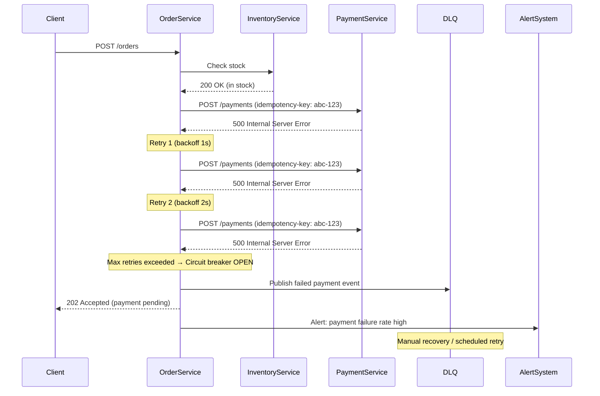

# 7. Chaos Engineering in Practice — Experiments

## 1. Hai Experiment Plans

### Experiment A — Latency Injection (Inventory Service +3s latency)

| Nội dung | Mô tả |
|---|---|
| **Hypothesis** | Khi Inventory Service bị latency 3s, Order Service sẽ timeout sau 2s, circuit breaker sẽ mở sau 3 lần thất bại liên tiếp, và trả lỗi graceful cho client thay vì treo request. |
| **Fault** | Inject 3-second latency vào mọi response từ Inventory Service (dùng Toxiproxy hoặc mock server delay). |
| **Blast radius** | Chỉ ảnh hưởng luồng check inventory trong Order Service. Các luồng khác (payment, notification) không bị tác động. |
| **Expected behavior** | - Order Service timeout sau 2s, không chờ đủ 3s. - Circuit breaker mở sau 3 failed calls → trả fallback response (e.g. "Hệ thống đang bận, vui lòng thử lại"). - Không có request nào bị treo vô thời hạn. - Các order đang xử lý khác vẫn hoạt động bình thường (bulkhead). |
| **Timeout/Retry/Circuit Breaker behavior** | - **Timeout**: 2s cho mỗi call tới Inventory Service. - **Retry**: Tối đa 2 lần retry với exponential backoff (500ms, 1s). Mỗi retry vẫn bị timeout 2s. - **Circuit breaker**: Mở sau 3 failures trong 10s, half-open sau 30s, thử 1 request để kiểm tra recovery. |
| **Abort condition** | - Error rate toàn hệ thống > 50% trong 1 phút. - Latency p99 của Order Service > 10s. - Số lượng request queue tăng bất thường (backpressure). |
| **Metrics** | - `order_service_inventory_call_duration_seconds` (histogram) - `circuit_breaker_state` (open/closed/half-open) - `order_service_timeout_total` (counter) - `order_service_error_rate` (gauge) |
| **Rollback** | Tắt latency injection trên Toxiproxy. Circuit breaker tự chuyển về half-open → closed khi Inventory Service recovery. |

---

### Experiment B — Payment Service Returns HTTP 500 (20% request, 5 phút)

| Nội dung | Mô tả |
|---|---|
| **Hypothesis** | Khi Payment Service trả 500 cho 20% request, Order Service sẽ retry có idempotency key, không gây duplicate charge. Sau nhiều lần 500, order sẽ được đưa vào DLQ để xử lý thủ công thay vì mất tiền hoặc mất đơn. |
| **Fault** | Payment Service trả HTTP 500 cho 20% request ngẫu nhiên trong 5 phút (dùng mock server fault injection hoặc Chaos Mesh HTTP fault). |
| **Blast radius** | Chỉ ảnh hưởng luồng thanh toán. Luồng tạo order, check inventory vẫn hoạt động. Khoảng 20% đơn hàng sẽ gặp lỗi payment. |
| **Expected behavior** | - 80% order xử lý bình thường. - 20% order gặp lỗi payment → retry tối đa 3 lần với idempotency key. - Nếu retry vẫn 500 → order chuyển sang trạng thái `PAYMENT_FAILED`, event đẩy vào DLQ. - **Không có duplicate charge** nhờ idempotency key. - Client nhận thông báo "Thanh toán thất bại, đang xử lý". |
| **Timeout/Retry/Circuit Breaker behavior** | - **Timeout**: 5s cho mỗi payment call. - **Retry**: Tối đa 3 lần, exponential backoff (1s, 2s, 4s). Mỗi retry gửi cùng idempotency key để tránh duplicate charge. - **Circuit breaker**: Mở khi error rate > 50% trong 10s. Khi mở, các payment request mới đi thẳng vào DLQ thay vì gọi Payment Service. |
| **Abort condition** | - Phát hiện duplicate charge (bất kỳ 1 case). - Error rate toàn hệ thống > 70%. - DLQ size tăng quá 1000 messages. |
| **Metrics** | - `payment_service_error_total` (counter, label: status_code) - `payment_retry_count` (histogram) - `duplicate_charge_detected` (counter — phải luôn = 0) - `dlq_message_count` (gauge) - `order_payment_failed_total` (counter) |
| **Rollback** | Tắt fault injection. Xử lý thủ công các order trong DLQ (retry payment hoặc refund). Verify không có duplicate charge qua reconciliation. |

---

## 2. Sequence Diagram — Failure Flow (Payment 500)

---

## 3. Danh sách Metrics, Logs, Alerts bắt buộc

### Metrics

| Metric | Type | Mô tả |
|---|---|---|
| `http_request_duration_seconds` | Histogram | Latency của các downstream calls (inventory, payment) |
| `circuit_breaker_state` | Gauge | Trạng thái circuit breaker (0=closed, 1=open, 2=half-open) |
| `retry_attempts_total` | Counter | Tổng số retry theo service và reason |
| `timeout_total` | Counter | Số request bị timeout theo service |
| `error_rate` | Gauge | Tỉ lệ lỗi hiện tại theo service |
| `dlq_message_count` | Gauge | Số message trong DLQ |
| `duplicate_charge_detected` | Counter | Phát hiện duplicate charge (target: 0) |
| `order_status_total` | Counter | Số order theo trạng thái (success, payment_failed, timeout) |

### Logs

| Log | Level | Khi nào |
|---|---|---|
| `Inventory call timeout after {duration}ms` | WARN | Timeout khi gọi Inventory Service |
| `Payment failed, retrying ({attempt}/{max})` | WARN | Mỗi lần retry payment |
| `Circuit breaker opened for {service}` | ERROR | Circuit breaker chuyển sang OPEN |
| `Order {id} sent to DLQ after max retries` | ERROR | Order chuyển vào DLQ |
| `Duplicate charge detected for order {id}` | CRITICAL | Phát hiện charge trùng |
| `Circuit breaker half-open, testing {service}` | INFO | Circuit breaker thử recovery |
| `Circuit breaker closed for {service}` | INFO | Service recovery thành công |

### Alerts

| Alert | Condition | Severity | Action |
|---|---|---|---|
| **HighErrorRate** | Error rate > 30% trong 2 phút | Warning | Kiểm tra service health |
| **CircuitBreakerOpen** | Circuit breaker ở trạng thái OPEN > 1 phút | Critical | Kiểm tra downstream service |
| **DLQBacklog** | DLQ size > 100 messages | Warning | Trigger manual review |
| **DuplicateCharge** | `duplicate_charge_detected` > 0 | Critical | Dừng experiment ngay, reconciliation |
| **HighLatency** | p99 latency > 5s trong 3 phút | Warning | Kiểm tra latency injection scope |
| **PaymentFailureSpike** | Payment failure > 50% trong 1 phút | Critical | Dừng experiment, kiểm tra Payment Service |

---

## Ghi chú quan trọng

- **Retry có thể làm sự cố tệ hơn**: Khi Payment Service đang quá tải trả 500, retry tạo thêm load → cần exponential backoff + circuit breaker để ngắt sớm thay vì retry liên tục.
- **Phân biệt retry vs circuit breaker**: Retry giúp khắc phục lỗi tạm thời (transient fault). Circuit breaker ngắt hoàn toàn khi service thực sự down, tránh cascade failure. Retry mà không có circuit breaker sẽ gây thundering herd.
- **DLQ cho thao tác tài chính**: Payment failure sau max retry → đẩy vào DLQ + lưu trạng thái `PAYMENT_FAILED`. Đội ops sẽ manual review/retry hoặc thực hiện refund nếu charge đã thành công nhưng response bị mất.

